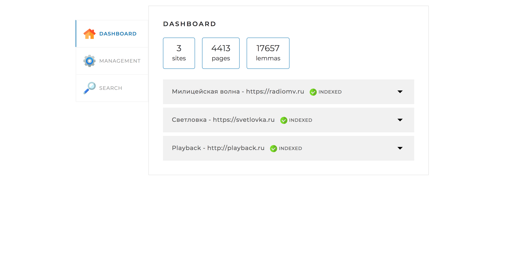
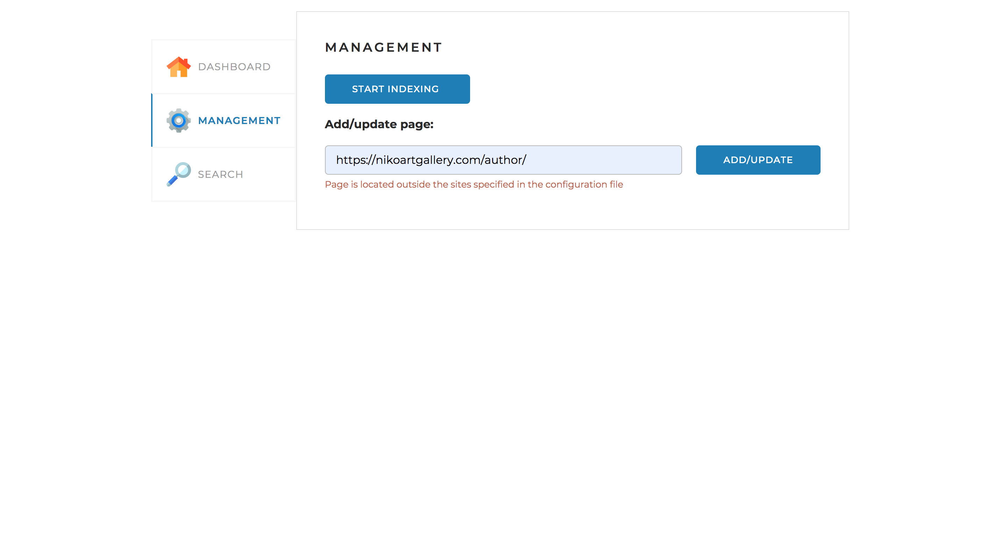
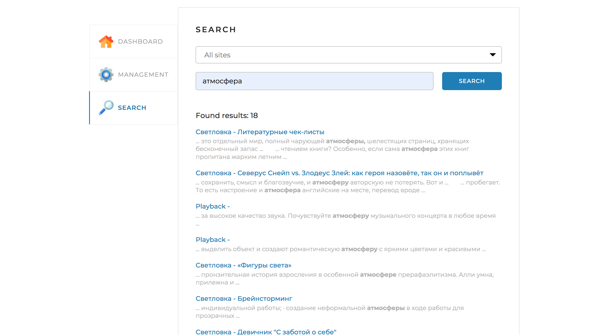
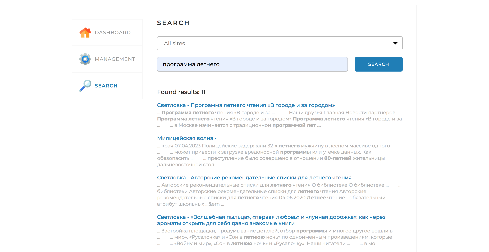
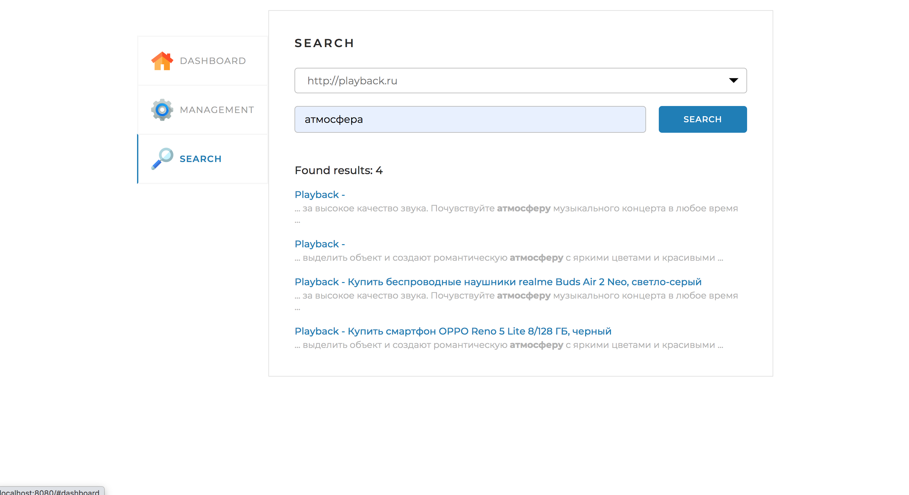

Реализован механизм, позволяющий обеспечить анализ указанного сайта с целью последующей организации поиска по страницам данного сайта

# **Технологии**

Spring Boot 2.7.1,
Maven,
Russian Morphology for Apache Lucene,
JSOUP,
Lombok

# **Взаимодействие с приложением**

Веб-интерфейс приложения реализован на одной веб-странице с тремя вкладками:

DASHBOARD – содержит статистику по сайтам

MANAGEMENT – запуск и остановка полной индексации (переиндексации), а также возможность добавить (обновить) отдельную страницу.

1.Если данной страницы нет в конфигурационном файле

2.Если есть в конфигурационном файле

SEARCH – содержит поле поиска и выпадающий список для выбора сайта

1.Поиск по всем сайтам

2.Поиск по сайту из списка

# **Запуск приложения**

Для функционирования поискового движка необходим MySQL сервер, а также предварительные настройки:
- создание пустой базы данных search_engine. Необходимо использовать кодировку utf8;
- указание в файле конфигурации application.yaml параметров подключения к базе данных в разделе spring.datasource: username, password, url;
- указание в файле конфигурации application.yaml сайтов для индексации и дальнейшего поиска по ним.
Для доступа к веб-интерфейсу необходимо запустить приложение и перейти в браузере по адресу http://localhost:8080/